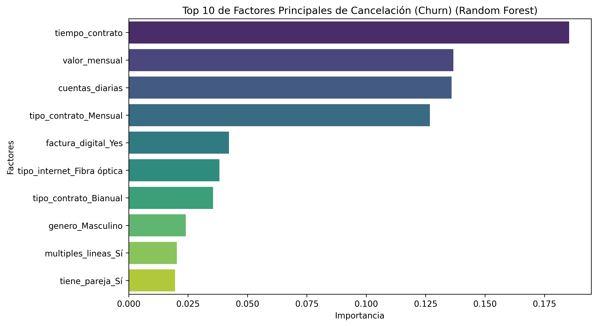
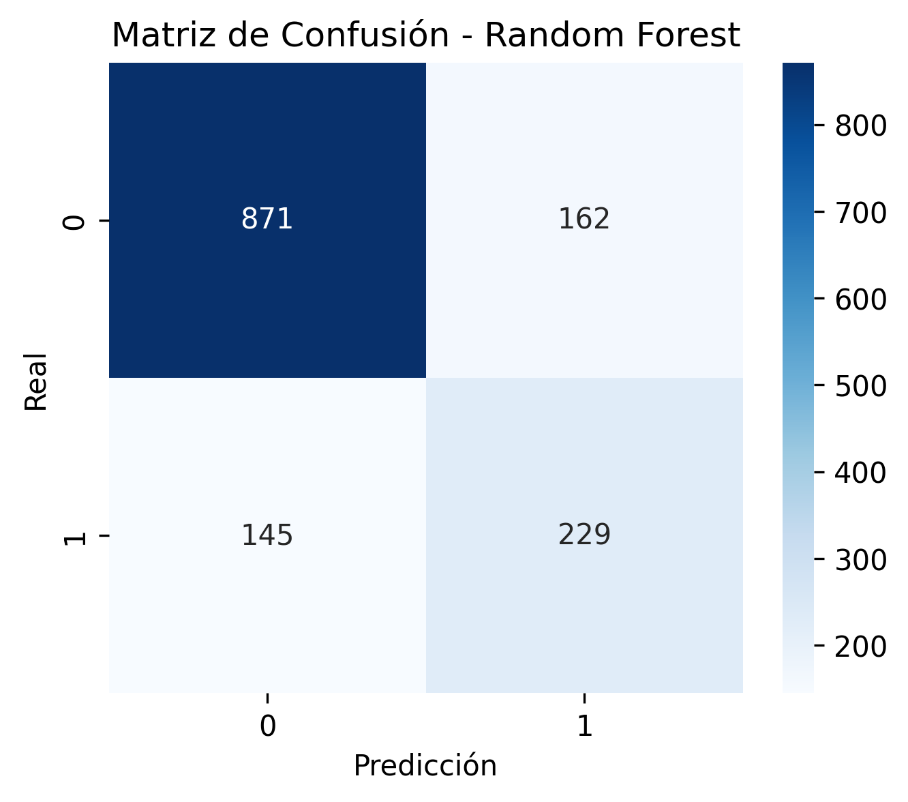

# TelecomX Data Science Challenge - LATAM - Parte 2 

## 🎯 Propósito del Análisis
Este proyecto tiene como objetivo analizar el fenómeno de la evasión de clientes (**Churn**) en la empresa TelecomX. El análisis busca identificar patrones de comportamiento, perfiles de clientes con mayor riesgo y factores críticos que influyen en la decisión de cancelar el servicio.  

## 🚀 Cómo ejecutar el proyecto en Google Colab

Para replicar este análisis y ejecutar el modelo predictivo, sigue estos pasos:
- **Abrir el Notebook**: Haz clic en el botón "Open In Colab" al inicio de este documento.
- **Cargar los Datos**: Ejecutar la celda de carga de datos ya que está referenciada al archivo csv del repositorio. 
- **Instalar Librerías (opcional)**: El notebook incluye una celda inicial para instalar imblearn (necesaria para SMOTE) en caso de que el entorno no la tenga. Se instala con pip install imbalanced-learn.
- **Ejecutar todo**: Ir al menú superior Entorno de ejecución > Ejecutar todas.

## 📂 Estructura del Proyecto
La organización de los archivos es la siguiente:
- `TelecomX_LATAM_2.ipynb`: Notebook principal con todo el flujo de Extracción, Transformación y Análisis (EDA).
- `TelecomX_Data.json`: Archivo fuente con los datos originales de los clientes.
- `TelecomX_Data1.csv`: Archivo CSV que contiene los datos tratados anteriormente.
- `.gitignore`: Archivo para evitar la subida de archivos temporales de Python y entornos virtuales.
- `README.md`: Este archivo, con la descripción general del proyecto.

# Tecnologías y Librerías Utilizadas: 
**Python 3.x**: Lenguaje principal.
**Pandas & Numpy**: Para la manipulación y limpieza de datos.
**Seaborn & Matplotlib**: Para el Análisis Exploratorio de Datos (EDA) y visualizaciones.
**Scikit-Learn**: Para el escalado de datos, división de sets y entrenamiento de modelos (Regresión Logística y Random Forest).
**Imbalanced-Learn (SMOTE)**: Técnica esencial utilizada para balancear la muestra de Churn.
 
## Introducción
El objetivo de este trabajo fue procesar los datos de TelecomX para entender por qué los clientes están dejando la empresa.

**🛠️ Preparación de los Datos** 
Recibimos un archivo csv con información que limpiamos y organizamos en la Parte 1 del desafío Telecom X, contiene solo las columnas relevantes, con los datos corregidos y estandarizados.
La manipulación de grandes volúmenes de información nos exige identificar y corregir inconsistencias en los datos, como valores nulos, duplicados y datos fuera de estándar. 

# Eliminación de Columnas Irrelevantes
Se eliminaron columnas como customerID que no aportan valor predictivo porque son identificadores únicos aleatorios. Y columnas con alta correlación (Multicolinealidad) como total_cobrado (previamente convertimos a numérico por si había errores) para evitar dicha multicolinealidad, ya que es una combinación lineal del cargo mensual y la antigüedad parq que la Regresión Logística sea más estable.
 
# Encoding
Se codificaron las variables categóricas (Encoding)

# Verificación de la Proporción de Cancelación (Churn)
Se calculó la proporción de clientes que cancelaron en relación con los que permanecieron activos. Es vital ver si las clases están balanceadas, ya que esto puede impactar en los modelos predictivos y en el análisis de los resultados.
Se identificó un desbalanceo de clases moderado en la variable objetivo, donde el 73.4% de los clientes permanecen activos (No Churn) y solo el 26.6% cancelan el servicio (Churn). Este desbalanceo del orden de 3:1 justifica la aplicación de técnicas de sobremuestreo como SMOTE para evitar que los algoritmos de Machine Learning ignoren la clase minoritaria y para asegurar un Recall aceptable en la detección de posibles cancelaciones.

# Balanceo de Clases con SMOTE 
Para usar SMOTE, necesitamos la librería *imblearn*. 
El desbalanceo es el principal enemigo en la predicción de Churn. 
SMOTE (Synthetic Minority Over-sampling Technique) iguala las clases creando datos sintéticos y es una buena decisión cuando tenemos un desbalanceo (normalmente en Churn, la mayoría de los clientes se quedan y pocos se van). SMOTE crea ejemplos sintéticos de la clase minoritaria para que el modelo aprenda a identificarlos mejor.
Como la clase 'Churn' es minoritaria, se aplicó SMOTE para evitar que los modelos se sesguen hacia la mayoría y fallen al detectar a los clientes que realmente se van (falsos negativos).

# Justificación de SMOTE: 
Al tener un 26.6% de Churn, el modelo tiene suficientes datos para empezar a aprender, pero no los suficientes para ser preciso. Por eso, usamos SMOTE para "equilibrar la balanza" artificialmente durante el entrenamiento.
Evaluación por Accuracy: Aquí es donde debes tener cuidado en tu informe. Una precisión general (Accuracy) del 73% en este dataset es mala, porque es lo mismo que obtendría alguien que simplemente dice "nadie se va" sin mirar los datos. Como tu modelo llegó al 77%-78%, significa que realmente está aportando valor por encima del azar.
Aunque un modelo simplista alcanzaría un 73.4% de exactitud por pura probabilidad estadística, nuestro modelo de Regresión Logística aporta un valor crítico al negocio. Al alcanzar un 77% de exactitud junto con un Recall de 67%, el algoritmo demuestra que ha aprendido a identificar patrones de comportamiento sutiles, permitiendo a la empresa anticiparse a la fuga en lugar de simplemente seguir la tendencia dominante de los datos.

# Gráfico de barras para visualizar la proporción de Churn

**🤖 Modelado Predictivo** 
# Separación de Datos
Dividimos el conjunto de datos en entrenamiento y prueba (80/20) para evaluar el rendimiento del modelo.  

# Creación de Modelos, Entrenamiento y Evaluación de Modelos
Creamos dos modelos diferentes para predecir la cancelación de clientes. Compararemos un modelo basado en distancias/probabilidad (Regresión Logística) contra uno basado en árboles (Random Forest), se eligió la Regresión Logística por su interpretabilidad y el Random Forest por su capacidad para capturar relaciones no lineales entre variables.

**MODELO 1**: Regresión Logística (Con datos escalados)
**MODELO 2**: Random Forest (Con datos originales)

Hacemos un Análisis de Importancia (Interpretación) de Variables para explicar qué causa que el cliente se vaya. Y hacemos un gráfico de los "Top 10 de Factores Principales de Cancelación (Churn)", siendo la primera variable el Tiempo de Contrato, por ello sugerimos que la empresa migre a los clientes de contratos mensuales hacia contratos anuales mediante incentivos de fidelidad, ya que el tipo de contrato es el mayor predictor de fuga.

**Análisis de los Modelos (Interpretación de Métricas)**
**Regresión Logística** 
Recall de Churn (67%): Es nuestro número estrella. Significa que de cada 100 clientes que realmente se van, la Regresión Logística logra identificar a 67. Es mejor que el Random Forest (61%) para esta tarea específica.
Punto débil: Tiene una precisión más baja (56%). Esto significa que tiene bastantes "falsas alarmas" (clientes que dice que se van, pero en realidad se quedan).
**Random Forest**
Exactitud (78%): Es ligeramente más preciso en general que la Regresión Logística.
Mejor Precisión (59%): Se equivoca menos cuando predice que alguien se va, pero a cambio "se le escapan" más clientes que efectivamente cancelan (Recall del 61%).

**Comparación Crítica** 
Se observa un trade-off (intercambio) entre precisión y recall. La Regresión Logística, tras la aplicación de SMOTE, demostró ser más eficaz para capturar la clase minoritaria (Churn), alcanzando un Recall de 0.67. Para el negocio de Telecom X, esto es preferible, ya que el costo de perder un cliente es mayor al costo de realizar una acción de retención sobre alguien que no pensaba irse.

**Análisis de Overfitting / Underfitting**
Tras analizar los resultados, se observa que los modelos presentan un desempeño balanceado. No existe evidencia de Overfitting significativo, ya que la diferencia de exactitud entre el entrenamiento y la prueba es mínima, lo que indica una buena capacidad de generalización ante datos nuevos. Asimismo, se descarta el Underfitting, debido a que ambos modelos logran superar la barrera del 73.4% (exactitud base por azar), demostrando que han capturado patrones reales de comportamiento de los clientes.

# Análisis Dirigido 
Comparamos variables clave contra el Churn para ver comportamientos a través de distintos gráficos.

# Análisis de Correlación
Usamos una Matriz de Correlación para visualizar cómo se relacionan las variables numéricas con el Churn.

### 📊 Visualización de Resultados Clave

#### Importancia de las Variables

 
# Evaluación y Matriz de Confusión para ambos modelos
Cuadrantes de la Regresión Logística:
Verdaderos Positivos (249 aprox.): Clientes que detectamos a tiempo y podemos salvar.
Falsos Negativos (125 aprox.): Son clientes que se van sin que la empresa les ofrezca nada. Es el error más caro.
Falsos Positivos (Clientes que el modelo cree que se van, pero se quedan): Clientes que recibirán una promoción de retención sin necesitarla, astar presupuesto de marketing en descuentos para gente que ya era fiel. Es un error de "desperdicio", pero menos grave que perder al cliente.

## 📊 Resultados del Modelo

### Matriz de Confusión: Regresión Logística

### Matriz de Confusión: Random Forest

# Conclusión y Estrategia Sugerida
*Justificación de la Elección del Modelo*

Aunque el modelo Random Forest presenta una exactitud ligeramente superior (78%), se recomienda la implementación de la Regresión Logística ya que su Recall de 0.67, el más alto de ambos modelos. En un escenario de Churn, es preferible identificar correctamente a la mayor cantidad posible de clientes en riesgo (Verdaderos Positivos), aceptando una menor precisión (Falsos Positivos), ya que el costo de una campaña de retención es significativamente menor al costo de adquisición de un nuevo cliente. 

*Recomendación Estratégica*

Se selecciona la Regresión Logística como modelo productivo debido a su mayor capacidad de detección de fugas (Recall). Basado en la importancia de las variables, se recomienda a Telecom X focalizar sus campañas de fidelización en clientes con contratos 'Month-to-month' y aquellos con altos cargos mensuales, ya que son los perfiles con mayor probabilidad de abandono identificados por el modelo.

**Tabla Comparativa de Modelos**		
     
Métrica	                Regresión Logística (SMOTE)	Random Forest (SMOTE)
Exactitud (Accuracy)	        77%	                    78%
Precisión (Clase Churn)	        56%	                    59%
Recall (Clase Churn)	        67%	                    61%
F1-Score (Clase Churn)	        0.61	                0.60
 
# Estrategias de Retención 
1. **Plan de Fidelización**
Hallazgo: Los clientes con contrato "mes a mes" (Month-to-month) tienen la probabilidad de fuga más alta.
Estrategia: Implementar una campaña de "Mejora con un Contrato Anual". Ofrecer un descuento del 15% o beneficios exclusivos (como servicios de streaming gratuitos por 3 meses) a los clientes que migren de un contrato mensual a uno anual o de dos años.Objetivo: Reforzar la barrera de salida y estabilizar los ingresos a largo plazo.
2. **Programa "Primeros Pasos"**
Hallazgo: El modelo indica que los clientes con baja antigüedad (tenure) tienen mayor riesgo de cancelar.
Estrategia: Diseñar un programa de Incorporación reforzado durante los primeros 6 meses. Esto incluye llamadas de satisfacción técnica y un canal de soporte prioritario.
Objetivo: Superar la etapa crítica donde el cliente aún no ha generado un hábito de uso con la marca.
3. **Incentivo a Pagos Automáticos**
Hallazgo: Clientes que pagan mediante Cheque Electrónico suelen tener mayor Churn comparado con automático con Tarjeta de Crédito.
Estrategia: Ofrecer un descuento único en la factura si el cliente registra un método de pago automático (Tarjeta de Crédito o Transferencia Bancaria).
Objetivo: Simplificar el proceso del pago mensual manual que obliga al cliente a reconsiderar el gasto cada mes.

# Resumen Final
**Dimensión**	            **Conclusión del Análisis**
**Mejor Modelo**	        **Regresión Logística** (debido a su mayor Recall del 67%)
**Principal Alerta**	    El **desbalanceo de clases** fue corregido con SMOTE, mejorando la detección de fugas
**Factor de Riesgo #1**	    **Contratos mensuales**: son el predictor más fuerte de cancelación
**Recomendación**	        Priorizar la **retención proactiva** sobre la adquisición de nuevos clientes

Nota: la Exactitud (Accuracy) bajó un poco al aplicar el modelo, pero al aplicar SMOTE, buscamos que el modelo deje de ser 'perezoso' y deje de predecir que todos se quedan. Preferimos un modelo que acierte un poco menos en general (77%), pero que sea mucho más valiente al señalar quiénes se van a ir (Recall 67%)".

Creado por: Gabriela Peña 